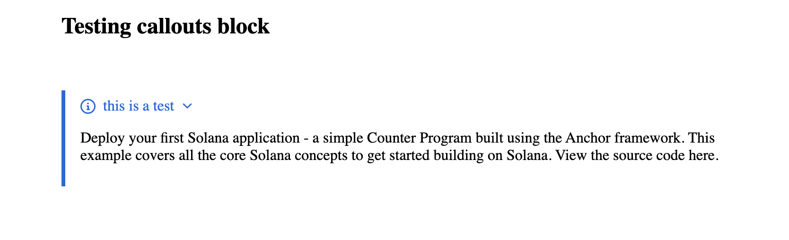
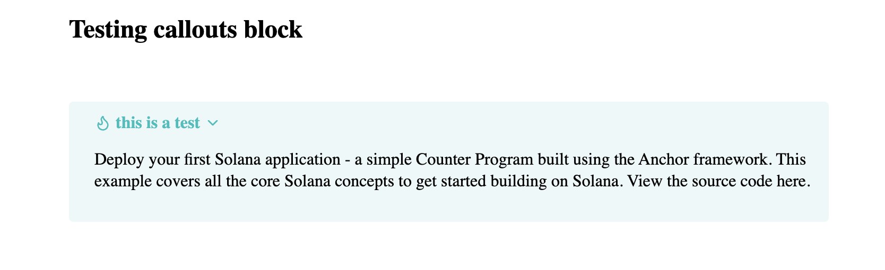

# Payload Callouts Plugin

A Payload CMS plugin for creating beautiful callout blocks with GitHub and Obsidian themes.




## Features

**Multiple Themes**: GitHub and Obsidian-style callouts  
**Rich Styling**: Pre-designed callout types with icons  
**Rich Text Support**: Full RichText editor support with nested content  
**Configurable**: Collapsible callouts with customizable defaults  

## Supported Callout Types

### GitHub Theme
- **Note** - General information
- **Tip** - Helpful suggestions  
- **Important** - Critical information
- **Warning** - Cautionary content
- **Caution** - Danger alerts

### Obsidian Theme
- **Note** - General notes
- **Abstract/Summary/Tldr** - Content summaries
- **Info** - Information blocks
- **Todo** - Task lists
- **Tip/Hint** - Helpful suggestions
- **Important** - Critical content
- **Success/Check/Done** - Completion status
- **Question/Help/FAQ** - Q&A content
- **Warning/Attention/Caution** - Warnings
- **Failure/Missing/Fail** - Error states
- **Danger/Error/Bug** - Critical errors
- **Example** - Code examples
- **Quote/Cite** - Quotations

## Installation

```bash
npm install payload-callouts
# or
yarn add payload-callouts
# or
pnpm add payload-callouts
```

## Setup

### 1. Configure the Plugin

Add the plugin to your Payload configuration:

```typescript
// payload.config.ts
import { payloadCallouts } from 'payload-callouts'

export default buildConfig({
  plugins: [
    payloadCallouts({
      theme: 'github', // or 'obsidian'
      blockSlug: 'callout', // optional, default: 'callout'
      blockInterfaceName: 'CalloutBlock', // optional, default: 'CalloutBlock'
      collapsible: true, // optional, default: true
      defaultOpen: true, // optional, default: true
    }),
  ],
  // ... rest of your config
})
```

### 2. Add the Block to Your Collections

```typescript
// collections/Posts.ts
import { createBlockConfig } from 'payload-callouts'

export const Posts: CollectionConfig = {
  slug: 'posts',
  fields: [
    {
      name: 'content',
      type: 'richText',
      editor: lexicalEditor({
        features: ({ rootFeatures }) => [
          ...rootFeatures,
          BlocksFeature({
            blocks: [
              createBlockConfig(), // Add callout blocks
              // ... other blocks
            ],
          }),
        ],
      }),
    },
  ],
}
```

### 3. Setup Frontend Rendering

Create a RichText component with callout converters:

```typescript
// components/RichText.tsx
import { createCalloutBlockJSXConverter } from 'payload-callouts/converters'
import {
  RichText as ConvertRichText,
  type JSXConvertersFunction,
} from '@payloadcms/richtext-lexical/react'

const jsxConverters: JSXConvertersFunction = ({ defaultConverters }) => {
  
  const calloutBlockConverter = createCalloutBlockJSXConverter((content) => (
    {/* Passing your customized RichText / ConvertRichText component */}
    <ConvertRichText converters={jsxConverters} data={content} />
  ));

  return {
    ...existingConverters,
    blocks: {
      ...existingConverters.blocks,
      ...calloutBlockConverter.blocks,
    },
  };
}

export default function RichText(props) {
  return (
    <ConvertRichText
      className="prose dark:prose-invert max-w-none"
      converters={jsxConverters}
      {...props}
    />
  )
}
```

## Configuration Options

```typescript
interface PayloadCalloutsConfig {
  /** Enable or disable the plugin */
  disabled?: boolean
  
  /** The slug for the callout block */
  blockSlug?: string // default: 'callout'
  
  /** Interface name for TypeScript generation */
  blockInterfaceName?: string // default: 'CalloutBlock'
  
  /** Theme to use */
  theme?: 'github' | 'obsidian' // default: 'github'
  
  /** Whether callouts are collapsible by default */
  collapsible?: boolean // default: true
  
  /** Whether callouts are open by default */
  defaultOpen?: boolean // default: true
}
```

## Styling

The plugin includes CSS modules for styling. You can customize the appearance by:

1. **Using CSS Custom Properties**: Override the built-in CSS variables
2. **Custom CSS**: Import and modify the provided styles
3. **Tailwind Classes**: Add additional classes to the rendered components

### CSS Custom Properties

```css
:root {
  --callout-border-radius: 8px;
  --callout-padding: 1rem;
  /* ... more variables */
}
```

## Contributing

Contributions are welcome! Please feel free to submit a Pull Request.

## License

MIT License - see [LICENSE](./LICENSE) file for details.